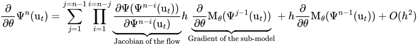
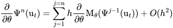

# Euler Gradient Approximation (EGA) 

## Introduction

Defining end-to-end (or online) training schemes for the calibration of deep learning based sub-models in hybrid systems requires working with an optimization problem that involves the solver of the physical equations. Online learning methodologies thus require the numerical model to be differentiable, which is not the case for most modeling systems that we really care about. To overcome this, we present an efficient and practical online learning approach for hybrid systems. The method, called EGA for Euler Gradient Approximation, assumes an additive neural correction to the physical model, and an explicit Euler approximation of the gradients.

The EGA is based on a decomposition of the gradient of the solver using an Euler solver approximation:



It gives rise to various formulations of the gradient of the solver, depending on the specification of the jacobian of the flow. The simplest formulation assumes a zero order approximation of the jacobian and results in the following "Static-EGA" formulation:



## Repository Overview
This repository contains experiments from the paper "Online Calibration of Deep Learning Sub-Models for Hybrid Numerical Modeling Systems." It includes two main folders. We recommend starting with the Lorenz 63 folder, which offers more examples and implementations of the EGA. You can find in this repo the following implementations: 
* EGA with full jacobian (first equation above), implemented in forward mode autodiff using functorch in notebook convergence_plot*.ipynb
* EGA with an ensemble approximation of the jacobian (ETLM-EGA), implemented in forward mode autodiff in notebook L63_EGA_Ensemble.ipynb
* Static EGA (second equation), impelmented using reverse mode autodiff and presented for example in the notebook L63_EGA_Static.ipynb

reverse mode autodiff used in static EGA (and in other EGA approximations) is implemented as follows:
```python
def forward(self, x, h, t0, grad_mode='exact'):
    with torch.no_grad():
        # blackbox non diff solver, here an adaptive dopri solver
        pred = odeint(self.hyb_model, x, torch.arange(t0, t0 + h + 0.000001, dt), method='dopri5')
    # computational graph of the blackbox solver
    pred_comp_g = h * self.M_theta(x.detach()) + x
    pred_comp_g.data = pred.data[-1, :, :]      
    return pred_comp_g
```
In this implementation, we associate to the non-differentiable solver odeint a computational graph that corresponds to the static EGA approximation (second equation above). 

## EGA for Improved Computational Complexity in Long Rollouts
We evaluate the EGA as an approximation of online learning in long rollouts. The notebooks performance_time_mem_plot_lots_steps_*.ipynb demonstrate the performance of EGA compared to full backpropagation through the computational graph, with results shown as a function of rollout length during training.
## Citation
If you find this interesting, please consider citing our work:

```bibtex
@article{ouala2023online,
  title={Online Calibration of Deep Learning Sub-Models for Hybrid Numerical Modeling Systems},
  author={Ouala, Said and Chapron, Bertrand and Collard, Fabrice and Gaultier, Lucile and Fablet, Ronan},
  journal={arXiv preprint arXiv:2311.10665},
  year={2023}
}

